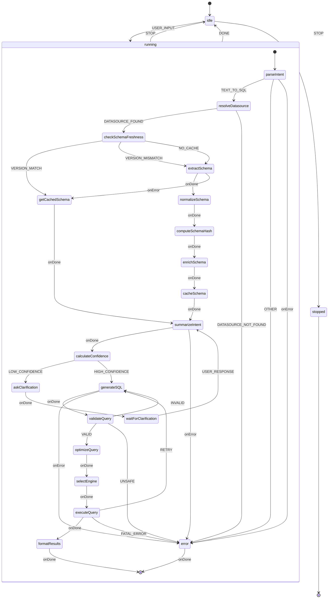

# Text-to-SQL Agent State Machine Diagram v2
## With Schema Versioning & Multiple Datasources

## XState-Compatible Mermaid State Diagram



## Enhanced State Descriptions

### Top-Level States

- **idle**: Waiting for user input
- **running**: Processing text-to-SQL request (composite state)
- **stopped**: Final state (agent terminated)

### Running Sub-States (with Versioning)

1. **parseIntent**: Extracts intent and datasource ID from user input
   - Routes to `resolveDatasource` if intent is `text-to-sql`
   - Routes to `summarizeIntent` if intent is `other` (then exits - no SQL generation)
2. **summarizeIntent**: Summarizes the user's natural language query intent with schema context
   - Takes the user query and normalized schema
   - Generates a clear summary of what the user wants to query
   - This summary is then used by `generateSQL` to create more accurate SQL
3. **resolveDatasource**: Resolves datasource from project context (handles multiple datasources)
4. **checkSchemaFreshness**: **Queries the actual datasource database** to get current schema version/metadata:
   - **PostgreSQL**: `SELECT version()` + query information_schema for table/column counts
   - **MySQL**: `SELECT VERSION()` + query information_schema
   - **MongoDB**: `db.version()` + collection count
   - **SQLite**: Schema hash from `sqlite_master` table
   - Compares with cached version (instant integer comparison)
5. **getCachedSchema**: Retrieves cached normalized schema (if version matches)
6. **extractSchema**: Full schema extraction from datasource (only if version differs or no cache)
7. **normalizeSchema**: Converts provider schema to standardized format (SQL or NoSQL JSON schema)
8. **computeSchemaHash**: Generates hash of normalized schema structure (for cache key)
9. **enrichSchema**: Adds sample data and metadata (optional, for better LLM context)
10. **cacheSchema**: Stores normalized schema in L1 (memory) and L2 (IndexedDB) caches with version
11. **generateSQL**: LLM generates SQL query with schema context
12. **calculateConfidence**: Calculates confidence score (0.0-1.0) for generated SQL:
    - Factors: schema match, query complexity, table/column name matching, intent clarity
    - If confidence < 0.5 → ask for clarification
    - If confidence >= 0.5 → proceed to validation
13. **askClarification**: Asks user clarifying questions about ambiguous parts of query
14. **waitForClarification**: Waits for user response, then re-generates SQL with additional context
15. **validateQuery**: Syntax validation and safety checks
16. **optimizeQuery**: Applies query optimizations (LIMIT, index hints, etc.)
17. **selectEngine**: Chooses optimal query execution engine (DuckDB, direct driver, etc.)
18. **executeQuery**: Executes query via selected engine
19. **formatResults**: Formats query results for user display

## Schema Versioning Flow

### Freshness Check Process

**checkSchemaFreshness** queries the **actual datasource database** (not our system) to get schema version/metadata:

#### PostgreSQL/PGlite
```sql
-- Get DB version
SELECT version();

-- Get schema metadata (table count, column count)
SELECT 
  COUNT(DISTINCT table_name) as table_count,
  COUNT(*) as column_count
FROM information_schema.columns 
WHERE table_schema = 'public';
```

#### MySQL
```sql
SELECT VERSION();
SELECT COUNT(DISTINCT table_name) as table_count 
FROM information_schema.tables 
WHERE table_schema = DATABASE();
```

#### SQLite
```sql
-- Get schema hash from sqlite_master
SELECT COUNT(*) as table_count, 
       GROUP_CONCAT(sql) as schema_sql 
FROM sqlite_master 
WHERE type = 'table';
-- Hash the schema_sql to get version
```

#### MongoDB
```javascript
db.version();
db.getCollectionNames().length; // collection count
```

### Version Comparison

1. **Query Datasource**: Execute provider-specific version/metadata query (< 100ms)
2. **Compute Version Signature**: Hash the result (table count, column count, DB version, etc.)
3. **Compare with Cache**: If cached signature === current signature → use cache (instant)
4. **If Signature Differs**: Extract full schema, normalize, cache with new signature

### Multiple Datasources Handling

The `resolveDatasource` state:
- Takes datasource ID from user intent or context
- Looks up datasource from project's datasource list
- Each datasource has its own version tracking
- Cache key: `schema:${datasourceId}:${versionSignature}`
- Version signature is computed from datasource DB metadata (not stored in our DB)

## Guard Conditions

- `TEXT_TO_SQL`: Intent detected as text-to-sql
- `OTHER`: Intent is "other" (not text-to-sql, route to summarizeIntent)
- `DATASOURCE_FOUND`: Datasource exists in project context
- `DATASOURCE_NOT_FOUND`: Datasource ID invalid or not accessible
- `VERSION_MATCH`: Cached version signature === current version signature from datasource DB (instant cache hit)
- `VERSION_MISMATCH`: Cached version signature !== current version signature (need fresh schema)
- `NO_CACHE`: No cached schema found for this datasource
- `LOW_CONFIDENCE`: Confidence score < 0.5 (ask for clarification)
- `HIGH_CONFIDENCE`: Confidence score >= 0.5 (proceed with validation)
- `VALID`: Query passes syntax and safety validation
- `INVALID`: Query has syntax errors (retryable)
- `UNSAFE`: Query contains destructive operations (non-retryable)

## Context Structure

```typescript
type AgentContext = {
  conversationId: string;
  inputMessage: string;
  datasourceId?: string;  // Resolved datasource ID
  datasource?: Datasource; // Full datasource object
  versionSignature?: string;  // Hash of datasource DB metadata (computed from actual DB)
  cachedVersionSignature?: string; // Cached version signature
  normalizedSchema?: NormalizedSchema; // SQL or NoSQL format
  schemaHash?: string;     // Hash of normalized schema (for cache key)
  generatedSQL?: string;   // Generated SQL query
  confidenceScore?: number; // Confidence score (0.0-1.0) for generated SQL
  clarificationQuestions?: string[]; // Questions to ask user if confidence is low
  clarificationContext?: string; // User's clarification response
  streamResult?: StreamTextResult;
  intent: Intent;
};
```

## Actions

- `assign`: Updates context with datasource, version signature, schema, confidence score
- `resolveDatasource`: Looks up datasource from project context
- `queryDatasourceVersion`: Queries actual datasource DB for version/metadata (provider-specific)
- `computeVersionSignature`: Generates hash from datasource metadata (table count, column count, DB version)
- `compareVersions`: Compares cached signature with current signature (instant)
- `computeSchemaHash`: Generates hash of normalized schema structure (for cache key)
- `cacheSchema`: Stores normalized schema in cache with version signature
- `calculateConfidence`: Computes confidence score (0.0-1.0) based on:
  - Schema match quality (how well tables/columns match user intent)
  - Query complexity vs intent complexity
  - Table/column name matching (exact match = higher confidence)
  - Intent clarity (ambiguous queries = lower confidence)
- `generateClarificationQuestions`: Generates questions to ask user when confidence is low
- `askUserForClarification`: Sends clarification questions to user and waits for response
- `logError`: Logs errors for debugging
- `retryWithFix`: Retries SQL generation with error context or clarification

## Events

- `USER_INPUT`: User sends natural language query (may include datasource ID)
- `STOP`: User cancels operation
- `onDone`: Actor completes successfully
- `onError`: Actor fails (with error type)

## Performance Characteristics

- **Freshness Check**: < 100ms (lightweight query to datasource DB for metadata)
- **Version Signature Comparison**: < 1ms (hash comparison)
- **Schema Extraction**: < 2s (only if version signature differs)
- **Cache Hit Rate**: ~95%+ (most schemas don't change frequently)

## How It Works

1. **User Query**: "Show me users from my PostgreSQL database"
2. **Resolve Datasource**: Look up datasource ID from project context
3. **Check Freshness**: Query PostgreSQL: `SELECT version(), COUNT(*) FROM information_schema.tables`
4. **Compute Signature**: Hash the result → `abc123...`
5. **Compare with Cache**: Cached signature = `abc123...` → **Match!** → Use cached schema (< 1ms)
6. **If Signature Differs**: Extract fresh schema, normalize, compute new signature, cache it

The version signature is computed from the **actual datasource database**, not stored in our system. This ensures we always check against the real source of truth.

## Confidence Score Calculation

The `calculateConfidence` state computes a confidence score (0.0-1.0) for the generated SQL query:

### Confidence Factors

1. **Schema Match Quality** (0.0-0.3):
   - Exact table/column name matches in user query → +0.3
   - Partial matches (fuzzy) → +0.15
   - No matches found → +0.0

2. **Query Complexity Alignment** (0.0-0.2):
   - Simple query (SELECT, WHERE) for simple intent → +0.2
   - Complex query (JOINs, subqueries) for complex intent → +0.2
   - Mismatch (complex query for simple intent) → +0.1

3. **Intent Clarity** (0.0-0.3):
   - Clear intent with specific table/column names → +0.3
   - Ambiguous intent (e.g., "show me data") → +0.1
   - Very vague intent → +0.0

4. **SQL Validity** (0.0-0.2):
   - Valid SQL syntax → +0.2
   - Syntax errors detected → +0.0

### Confidence Thresholds

- **< 0.5 (LOW_CONFIDENCE)**: Ask user for clarification
- **>= 0.5 (HIGH_CONFIDENCE)**: Proceed with validation and execution

### Clarification Flow

When confidence < 0.5:
1. **askClarification**: Generates specific questions based on low-confidence areas:
   - "Which table contains the data you're looking for?"
   - "Did you mean column X or column Y?"
   - "What specific filters should I apply?"
2. **waitForClarification**: Waits for user response
3. **Re-generate SQL**: Uses original query + clarification context to generate improved SQL
4. **Re-calculate Confidence**: Checks if confidence improved with clarification

### Example

```
User: "show me users"
Generated SQL: "SELECT * FROM users" (confidence: 0.4 - low because vague)
→ Ask: "Which users? All users, active users, or users created this month?"
User: "active users"
Re-generated SQL: "SELECT * FROM users WHERE status = 'active'" (confidence: 0.8 - high)
→ Proceed to validation
```

## Parallel Processing Opportunities

### 1. **enrichSchema** - Parallel Sample Data Fetching

**Location**: After `computeSchemaHash`, before `cacheSchema`

**What to parallelize**:
- Fetch sample rows for multiple tables simultaneously
- Fetch column statistics for multiple columns in parallel
- Get indexes for multiple tables concurrently

**Implementation**:
```typescript
// Instead of sequential:
for (const table of schema.tables) {
  const samples = await getSampleRows(table.name);
  // ...
}

// Do parallel:
await Promise.all(
  schema.tables.map(async (table) => {
    const [samples, stats, indexes] = await Promise.all([
      getSampleRows(table.name),
      getColumnStats(table.name),
      getIndexes(table.name)
    ]);
    return { table, samples, stats, indexes };
  })
);
```

**Performance gain**: If you have 5 tables, sequential takes ~5s, parallel takes ~1s

### 2. **resolveDatasource** - Multiple Datasources in Parallel

**Location**: After `parseIntent`, if query involves multiple datasources

**What to parallelize**:
- Check schema freshness for multiple datasources simultaneously
- Extract schemas from multiple datasources in parallel

**Implementation**:
```typescript
// If query mentions multiple datasources:
const datasourceIds = extractDatasourceIds(userQuery);
await Promise.all(
  datasourceIds.map(async (id) => {
    const freshness = await checkSchemaFreshness(id);
    if (!freshness.matches) {
      return await extractSchema(id);
    }
    return await getCachedSchema(id);
  })
);
```

**Performance gain**: 2 datasources: sequential ~2s → parallel ~1s

### 3. **extractSchema** - Parallel Table Extraction

**Location**: Inside `extractSchema` state

**What to parallelize**:
- Extract schema information for multiple tables/collections simultaneously
- Query information_schema for multiple tables in parallel

**Implementation**:
```typescript
// PostgreSQL: Extract multiple tables in parallel
await Promise.all(
  tableNames.map(async (tableName) => {
    const columns = await query(`SELECT * FROM information_schema.columns WHERE table_name = $1`, [tableName]);
    const indexes = await query(`SELECT * FROM pg_indexes WHERE tablename = $1`, [tableName]);
    return { tableName, columns, indexes };
  })
);
```

**Performance gain**: 10 tables: sequential ~10s → parallel ~1s

### 4. **checkSchemaFreshness** - Parallel Version Checks

**Location**: If multiple datasources detected

**What to parallelize**:
- Check freshness for multiple datasources concurrently
- Query version metadata from multiple DBs simultaneously

**Implementation**:
```typescript
const freshnessChecks = await Promise.all(
  datasourceIds.map(id => checkSchemaFreshness(id))
);
```

### Recommended Priority

1. **enrichSchema parallelization** - Highest impact, easiest to implement
2. **extractSchema parallelization** - High impact for schemas with many tables
3. **Multiple datasource parallelization** - Medium impact (less common use case)
4. **checkSchemaFreshness parallelization** - Lower impact (already fast, <100ms)

### XState Parallel States

In XState, use `type: 'parallel'` for concurrent execution:

```typescript
enrichSchema: {
  type: 'parallel',
  states: {
    fetchSamples: { /* fetch sample data */ },
    fetchStats: { /* fetch statistics */ },
    fetchIndexes: { /* fetch indexes */ }
  },
  onDone: { target: 'cacheSchema' }
}
```

